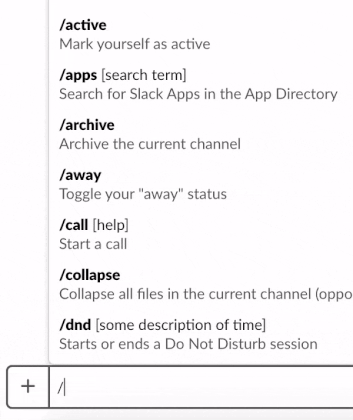

# slackbuild
Google [Cloud Build](https://cloud.google.com/cloud-build/) integration for Slack



[](https://travis-ci.org/mmercedes/slackbuild)

### Features

- Trigger cloudbuilds from slack
- Sends a slack notification when a new build is submitted or a build changes state
- Use templates to customize your build notifications (See the [templates readme](./templates/) for how)

### Install

- Clone this repo
- Create a new incoming webhook for Slack.  [Instructions](https://api.slack.com/incoming-webhooks)
- Add your slack token and signing secret to `env.yaml`.  [Example](./env.example.yaml)
  * secrets are in a seperate file so you can commit your `config.yaml` without exposing the token
- Create a `config.yaml` file.  [Commented Example](./config.example.yaml)
```yaml
slack:
  channel: '#test'
gcloud:
  project_id: 'my-project'
  gcs_bucket_url: 'gs://my-bucket'
```
- Run `make deploy`
  * Assumes you have the [gcloud sdk](https://cloud.google.com/sdk/install) installed and permission to create cloud functions and gcs buckets in the gcp project set in config.yaml
  * Assumes you have python 3.7 installed

### TODO

- Example terraform config to avoid manual creation of cloud funcion
- Attempt to publish to slack app store
