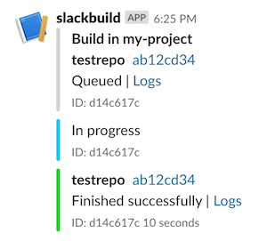

# slackbuild
Google [Cloud Build](https://cloud.google.com/cloud-build/) integration for Slack



### Install

- Clone this repo
- Create a new incoming webhook for Slack.  [Instructions](https://api.slack.com/incoming-webhooks)
- Add your slack token to `env.yaml`.  [Example](./env.yaml.example)
  * token is in a seperate file so you can commit your `config.json` without exposing the token
- Create a `config.json` file.  [Example](./config.json.example)
```
{
    "slack": {
        "channel": "#test" # channel to send notifications too
    },
    "gcloud": {
        "project_id": "my-project", # Google Cloud Project where Cloud Build is running
        "gcs_bucket_url": "gs://my-bucket" # Google Cloud Storage bucket to store deployed code in
    }
}
```
- Run `./deploy.sh`
  * this assumes you have the [gcloud sdk](https://cloud.google.com/sdk/install) installed and permission to create cloud functions and gcs buckets
  * This skips the tests. Run `make deploy` if you'd like to run the tests. (Assumes you have python 3.7 installed)

### TODO

- Support for custom message templates
- Example terraform config to avoid manual creation of cloud funcion
- Outgoing webhook mode to support Slack 'slash commands'
  * ex `/cloudbuilds <buildId> cancel`

